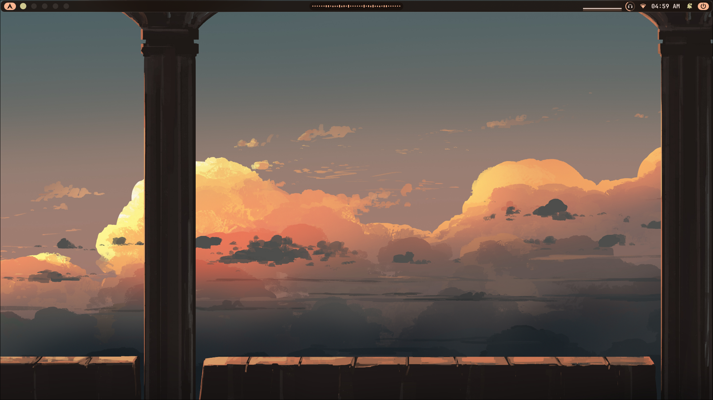
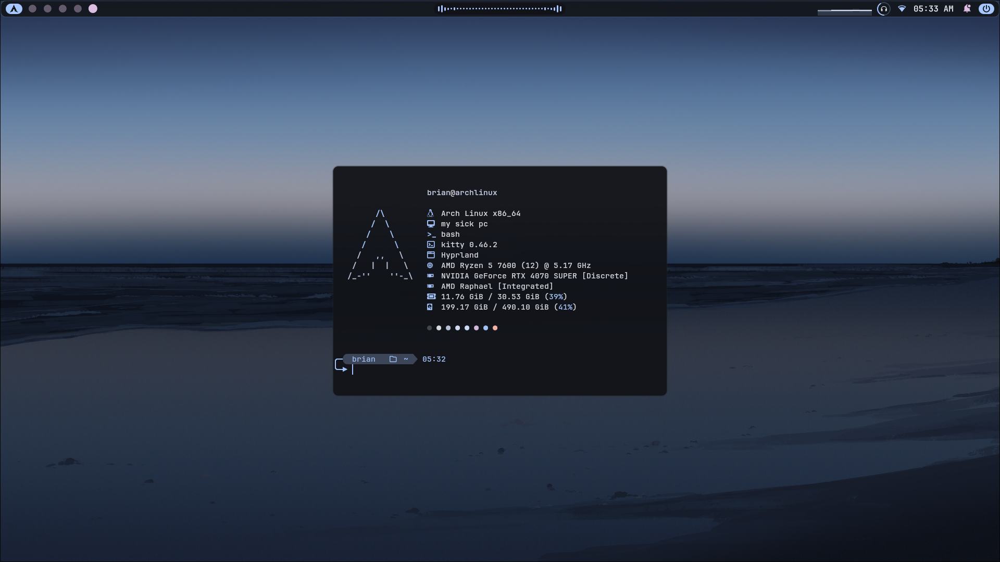
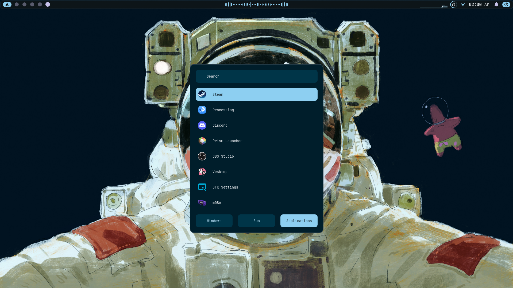
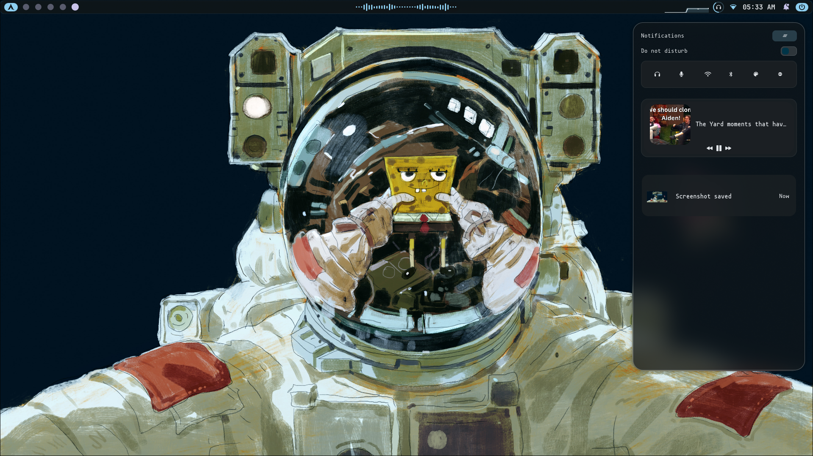

# dotfiles



Personal Arch Linux dotfiles for a Hyprland-based desktop environment.
Managed with two scripts that sync configs between the live system and this repo.
The setup is built around **matugen**, a material design color generator that
derives a full color palette from the current wallpaper. Every component
pulls from this palette, so the entire shell recolors itself automatically when the
wallpaper changes.

## Screenshots

| Desktop | Terminal |
|--------|--------|
|  |  |

| Rofi | Notifications |
|--------|--------|
|  |  |

## Setup

### Fresh install

Clone the repo and run the apply script. On a new system it will offer to
install all packages first:

```bash
git clone https://github.com/brian-brow/dotfiles.git ~/dotfiles
cd ~/dotfiles
chmod +x sync_from_repo.sh
./sync_from_repo.sh
```

The script will:
1. Detect a new system and offer to install all packages via pacman + yay
2. Ask whether this is the `desktop` or `laptop` branch
3. Pull the latest configs and apply them to the system

### Saving changes

After editing configs on your system, run from inside the repo:

```bash
cd ~/dotfiles
./sync_to_repo.sh
```

### Applying configs

To apply the repo configs to your live system:

```bash
cd ~/dotfiles
./sync_from_repo.sh
```
